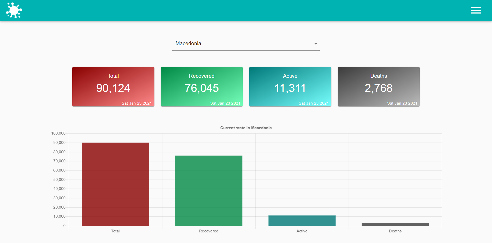
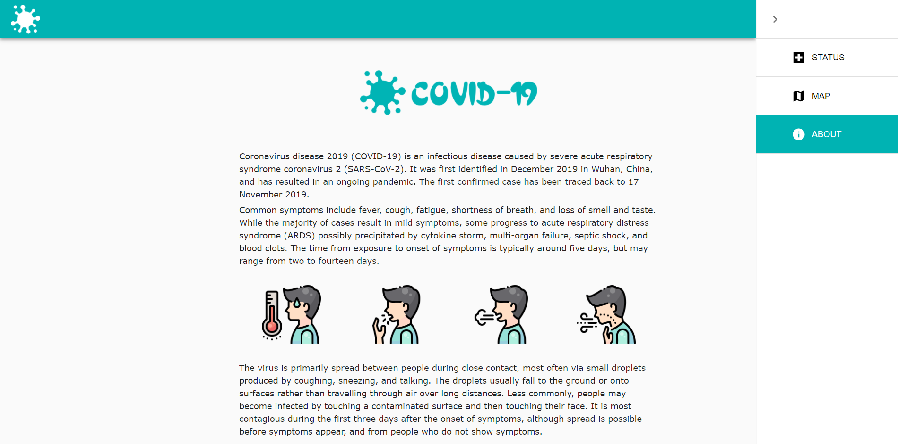
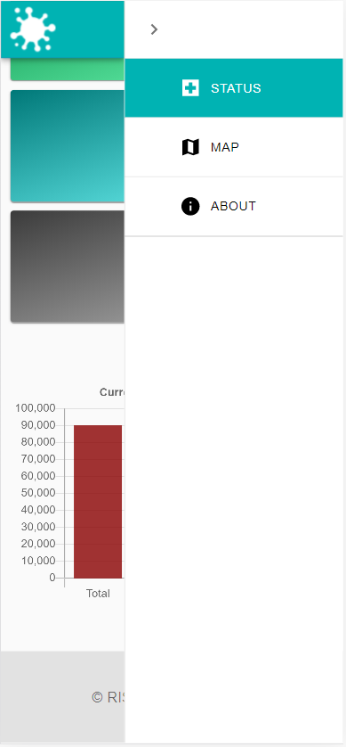

# Weather & Air check

## About 

A responsive, React.js web application that provides data of total infected, recovered, active, and death cases from Coronavirus globally and by country. 
The data is presented with numbers, charts, and a map.

## Views

- Status

- Map
 

- About

- Tablet
  

- Mobile

## Deployment
In progress...

## Technologies & Tools

- React.js
- Material UI
- Visual Studio Code

## Includes

- API 
- Styled components
- React Router
- React Hooks
- Axios
- Chart.js
- CountUp

